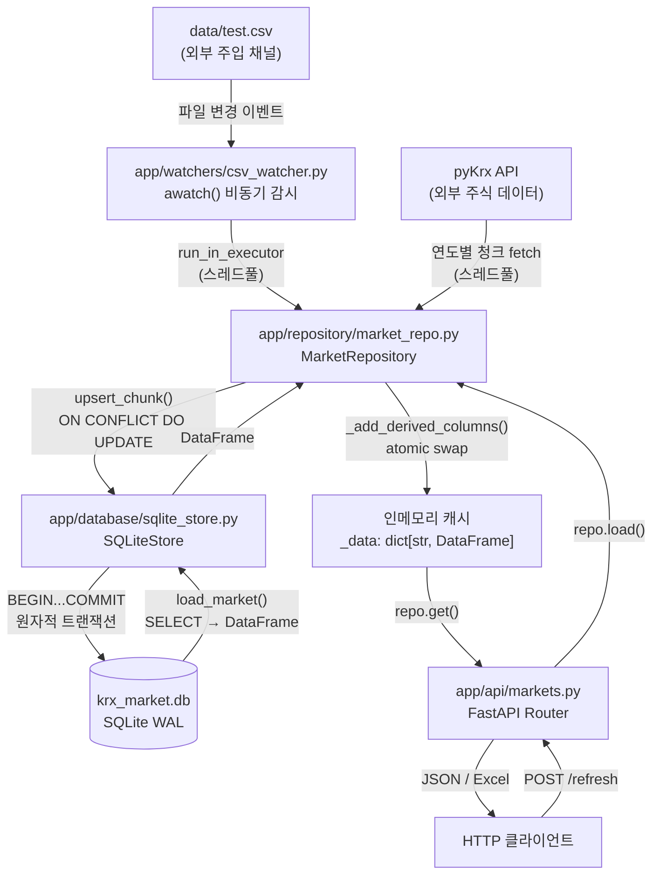
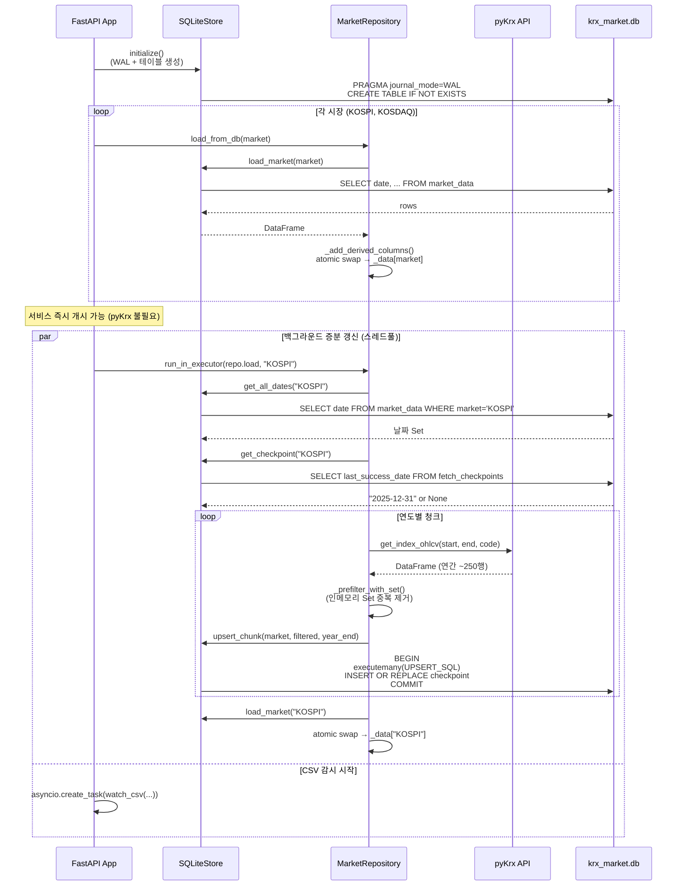
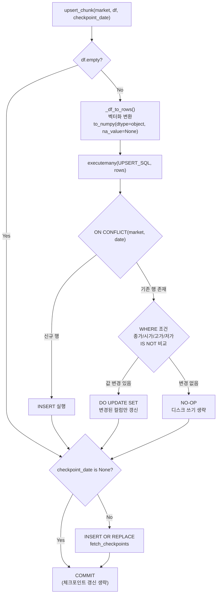
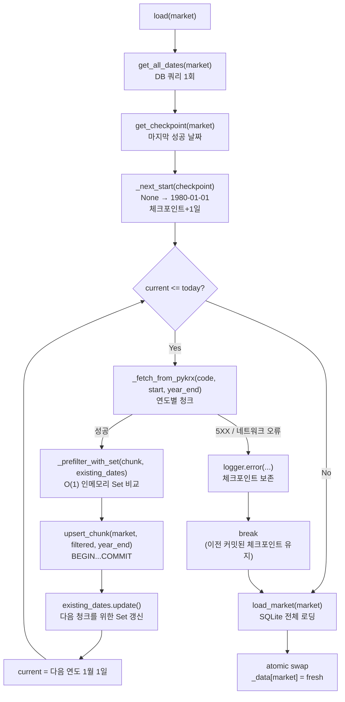
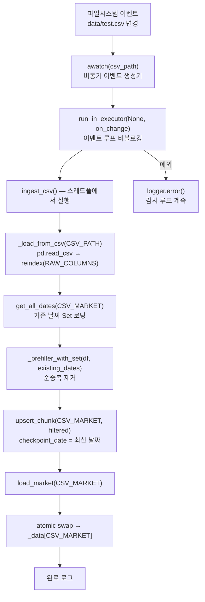

# KRX Market API — 기술 명세서

**버전**: 2.0.0  
**작성일**: 2026-06-17  
**대상**: KRX_GUI (FastAPI + pyKrx + SQLite)

---

## 목차

1. [아키텍처 개요](#1-아키텍처-개요)
2. [전체 데이터 흐름 다이어그램](#2-전체-데이터-흐름-다이어그램)
3. [컴포넌트별 흐름 다이어그램](#3-컴포넌트별-흐름-다이어그램)
4. [SQLite 데이터 스키마 명세](#4-sqlite-데이터-스키마-명세)
5. [비동기(Async) 처리 주의사항](#5-비동기async-처리-주의사항)
6. [에러 처리 및 복구 전략](#6-에러-처리-및-복구-전략)
7. [파일 구조](#7-파일-구조)

---

## 1. 아키텍처 개요

### 핵심 원칙

| 원칙 | 구현 |
|---|---|
| **SQLite = 진실의 원천** | 모든 데이터는 SQLite에 먼저 기록, 인메모리는 조회 전용 캐시 |
| **DB 레벨 중복 제거** | `ON CONFLICT DO UPDATE`로 애플리케이션 로직 없이 중복 방지 |
| **원자적 트랜잭션** | 연도별 청크 삽입 + 체크포인트 갱신을 단일 `BEGIN…COMMIT` 처리 |
| **WAL 동시성** | `journal_mode=WAL`로 읽기와 쓰기가 서로를 블로킹하지 않음 |
| **점진적 복구** | 서버 재시작 시 SQLite에서 즉시 복구 → pyKrx는 백그라운드 증분 동기화 |

### 레이어 구조

```
┌─────────────────────────────────────────────┐
│                  HTTP 클라이언트              │
└──────────────────────┬──────────────────────┘
                       │ REST API
┌──────────────────────▼──────────────────────┐
│         app/api/markets.py (APIRouter)       │  ← 변경 없음
│  GET /markets/{market}/filter               │
│  POST /markets/{market}/refresh             │
│  GET /markets/{market}/...                  │
└──────────────────────┬──────────────────────┘
                       │ repo.get() / repo.load()
┌──────────────────────▼──────────────────────┐
│    app/repository/market_repo.py            │
│    MarketRepository                         │
│    ┌────────────────────────────────────┐   │
│    │  _data: dict[str, DataFrame]       │   │  ← 조회 전용 인메모리 캐시
│    │  _lock: threading.Lock             │   │  ← atomic swap 보장
│    │  _load_locks: dict[str, Lock]      │   │  ← 시장별 중복 fetch 방지
│    └────────────────────────────────────┘   │
└──────────────────────┬──────────────────────┘
                       │ upsert_chunk() / load_market()
┌──────────────────────▼──────────────────────┐
│    app/database/sqlite_store.py             │
│    SQLiteStore                              │
│    ┌────────────────────────────────────┐   │
│    │  _conn: sqlite3.Connection         │   │  ← check_same_thread=False
│    │  _write_lock: threading.Lock       │   │  ← 쓰기 직렬화
│    └────────────────────────────────────┘   │
└──────────────────────┬──────────────────────┘
                       │
┌──────────────────────▼──────────────────────┐
│              krx_market.db (SQLite)          │
│  market_data       fetch_checkpoints        │
└─────────────────────────────────────────────┘
```

---

## 2. 전체 데이터 흐름 다이어그램



### 서버 시작 시퀀스



---

## 3. 컴포넌트별 흐름 다이어그램

### 3-1. Upsert 트랜잭션 흐름



### 3-2. pyKrx 증분 fetch 및 장애 복구



### 3-3. CSV 자동 흡수 흐름



---

## 4. SQLite 데이터 스키마 명세

### 4-1. PRAGMA 설정

```sql
PRAGMA journal_mode=WAL;      -- Write-Ahead Logging: 읽기와 쓰기 동시 허용
PRAGMA synchronous=NORMAL;    -- WAL 모드에서 안전, fsync 오버헤드 최소화
```

| PRAGMA | 기본값 | 설정값 | 이유 |
|---|---|---|---|
| `journal_mode` | DELETE | WAL | 읽기가 쓰기를 블로킹하지 않음 |
| `synchronous` | FULL | NORMAL | WAL에서 데이터 손실 없이 쓰기 속도 향상 |

### 4-2. market_data 테이블

```sql
CREATE TABLE IF NOT EXISTS market_data (
    market         TEXT NOT NULL,          -- 시장 코드: 'KOSPI' | 'KOSDAQ'
    date           TEXT NOT NULL,          -- 날짜: 'YYYY-MM-DD' 형식
    시가           REAL,                   -- 당일 시가 (NULL 허용)
    고가           REAL,                   -- 당일 고가 (NULL 허용)
    저가           REAL,                   -- 당일 저가 (NULL 허용)
    종가           REAL,                   -- 당일 종가 (NULL 허용)
    거래량         REAL,                   -- 당일 거래량 (NULL 허용)
    거래대금       REAL,                   -- 당일 거래대금, 단위: 원 (NULL 허용)
    상장시가총액   REAL,                   -- 상장 시가총액, 단위: 원 (NULL 허용)
    PRIMARY KEY (market, date)
) WITHOUT ROWID;
```

#### 설계 결정

| 항목 | 결정 | 이유 |
|---|---|---|
| PK 타입 | `(market, date)` 복합 PK | 시장+날짜 조합이 자연 식별자 |
| `WITHOUT ROWID` | 사용 | PK 전용 접근 → B-Tree 탐색 1회, 별도 rowid 오버헤드 제거 |
| 데이터 컬럼 `NULL` 허용 | `NOT NULL` 없음 | pyKrx/CSV 결측값을 에러 없이 자연 저장 |
| 날짜 타입 | `TEXT` | SQLite는 DATE 타입 없음; ISO 8601 문자열로 정렬 가능 |
| 수치 타입 | `REAL` (float64) | pyKrx·pandas 기본 숫자 타입과 일치 |

#### 인덱스

```sql
-- PRIMARY KEY 자체가 클러스터드 인덱스 (WITHOUT ROWID)
-- 추가 인덱스: 날짜 범위 조회 최적화
CREATE INDEX IF NOT EXISTS idx_market_data_date
    ON market_data (market, date DESC);
```

> **참고**: `WITHOUT ROWID` 테이블에서 PK 인덱스는 이미 클러스터드로 동작합니다.  
> 추가 인덱스는 날짜 내림차순 접근(최신 데이터 우선 조회)을 위한 것입니다.

### 4-3. fetch_checkpoints 테이블

```sql
CREATE TABLE IF NOT EXISTS fetch_checkpoints (
    market            TEXT PRIMARY KEY,    -- 시장 코드: 'KOSPI' | 'KOSDAQ'
    last_success_date TEXT NOT NULL,       -- 마지막 성공 날짜: 'YYYY-MM-DD'
    updated_at        TEXT NOT NULL        -- 갱신 시각: ISO 8601 ('2026-06-17T09:30:00')
) WITHOUT ROWID;
```

#### 체크포인트 동작

```
체크포인트 없음  → pyKrx fetch를 1980-01-01부터 시작
체크포인트 있음  → 해당 날짜 + 1일부터 재개 (중복 방지)
청크 fetch 실패  → 체크포인트 그대로 유지 (ROLLBACK 자동)
청크 fetch 성공  → INSERT OR REPLACE로 갱신 (행 없어도 안전)
```

### 4-4. Upsert SQL 상세

```sql
INSERT INTO market_data (market, date, 시가, 고가, 저가, 종가, 거래량, 거래대금, 상장시가총액)
VALUES (?, ?, ?, ?, ?, ?, ?, ?, ?)
ON CONFLICT(market, date) DO UPDATE SET
    시가         = excluded.시가,
    고가         = excluded.고가,
    저가         = excluded.저가,
    종가         = excluded.종가,
    거래량       = excluded.거래량,
    거래대금     = excluded.거래대금,
    상장시가총액 = excluded.상장시가총액
WHERE
    excluded.종가     IS NOT market_data.종가
    OR excluded.시가  IS NOT market_data.시가
    OR excluded.고가  IS NOT market_data.고가
    OR excluded.저가  IS NOT market_data.저가;
```

#### `IS NOT` vs `!=` — NULL 처리의 핵심

```sql
-- 위험: NULL 비교 시 항상 NULL 반환 → 변경 감지 실패
excluded.종가 != market_data.종가   -- NULL != NULL → NULL (false로 평가)

-- 안전: IS NOT은 NULL-safe 비교
excluded.종가 IS NOT market_data.종가  -- NULL IS NOT NULL → false (업데이트 안 함)
                                        -- NULL IS NOT 100  → true (업데이트 실행)
```

### 4-5. NULL / 결측값 처리 파이프라인

```
pyKrx / CSV 원본 데이터
        │
        ▼
df.replace([math.inf, -math.inf], float("nan"))
        │  pandas inf → NaN 변환 (벡터 연산)
        ▼
.to_numpy(dtype=object, na_value=None)
        │  NaN → Python None 변환 (벡터 연산)
        ▼
SQLite executemany()
        │  None → NULL 자동 변환 (sqlite3 드라이버)
        ▼
krx_market.db — NULL로 저장

복원 경로:
market_data SELECT → sqlite3 fetchall()
        │  NULL → None (자동)
        ▼
pd.DataFrame(rows)
        │  None → NaN (자동)
        ▼
df.astype(float)   — NaN 유지, float64 타입 보장
```

---

## 5. 비동기(Async) 처리 주의사항

### 5-1. 이벤트 루프 블로킹 금지

**문제**: `sqlite3`, `pykrx`, `pd.read_csv`는 모두 **동기(blocking) I/O** 함수입니다.  
이를 직접 `async def` 함수에서 호출하면 전체 이벤트 루프가 블로킹됩니다.

**해결**: `loop.run_in_executor(None, sync_fn)` 패턴으로 스레드풀에 위임.

```python
# ❌ 잘못된 예 — 이벤트 루프 블로킹
async def bad_handler():
    repo.load("KOSPI")  # blocking: sqlite3 + pykrx 동기 호출

# ✅ 올바른 예 — 스레드풀에 위임
async def good_handler():
    loop = asyncio.get_running_loop()
    await loop.run_in_executor(None, repo.load, "KOSPI")
```

**현재 코드에서 적용된 위치:**

| 위치 | 동기 함수 | run_in_executor 위치 |
|---|---|---|
| `main.py:35` | `repo.load(market)` | `_bg_load()` async wrapper |
| `csv_watcher.py:16` | `on_change()` (= `repo.ingest_csv`) | `watch_csv()` 내부 |
| `api/markets.py:54` | `repo.load(market)` | `refresh_market()` — **주의 참고** |

> **주의**: `POST /markets/{market}/refresh` 엔드포인트의 `repo.load(market)`은 현재 동기 호출입니다.  
> 요청이 완료될 때까지 해당 워커가 블로킹됩니다. uvicorn 워커가 여러 개라면 허용 가능하지만,  
> 단일 워커 환경에서는 `BackgroundTasks` 또는 `run_in_executor` 로 개선을 권장합니다.

### 5-2. asyncio.Task 생명주기 관리

```python
# main.py — lifespan 컨텍스트 매니저
@asynccontextmanager
async def lifespan(app: FastAPI):
    # ... 초기화 ...
    load_tasks = [asyncio.create_task(_bg_load(m)) for m in MARKET_CODES]  # ①
    csv_task = asyncio.create_task(watch_csv(CSV_PATH, repo.ingest_csv))   # ②

    yield  # 서비스 제공 중

    csv_task.cancel()                                         # ③ 명시적 취소
    with contextlib.suppress(asyncio.CancelledError):
        await csv_task                                        # ④ 취소 완료 대기
    await asyncio.gather(*load_tasks, return_exceptions=True) # ⑤ 로드 완료 대기
    store.close()                                             # ⑥ DB 연결 종료
```

| 단계 | 설명 |
|---|---|
| ① `create_task` | 백그라운드 Task 등록 → GC 방지를 위해 반드시 변수에 저장 |
| ② `create_task` | CSV 감시 루프 — `awatch()`는 무한 루프이므로 취소 필수 |
| ③ `cancel()` | `asyncio.CancelledError`를 Task 내부에 주입 |
| ④ `await csv_task` | 취소 완료까지 대기 — 누락 시 "Task destroyed but it is pending" 경고 |
| ⑤ `gather(return_exceptions=True)` | 로드 Task들이 자연 완료될 때까지 정상 대기 |
| ⑥ `store.close()` | yield 이후에만 실행 — 항상 정리됨 보장 |

### 5-3. threading.Lock 사용 패턴

**이중 잠금 구조**: `SQLiteStore`와 `MarketRepository`는 각각 독립적인 Lock을 보유합니다.

```
스레드 A (KOSPI fetch)     스레드 B (HTTP 요청)      스레드 C (CSV ingest)
         │                          │                         │
         ▼                          ▼                         ▼
  store._write_lock         repo._lock (읽기용)      store._write_lock
  (쓰기 직렬화)              (atomic swap 보호)        (쓰기 직렬화)
```

**데드락 방지**: 두 Lock을 동시에 획득하는 코드 경로가 없습니다.
- `upsert_chunk()`는 `store._write_lock`만 사용
- `get()` / atomic swap은 `repo._lock`만 사용
- 두 Lock을 중첩해서 획득하는 경로 없음 → 데드락 위험 없음

### 5-4. `awatch()` — 이벤트 중복 감지 주의

`watchfiles.awatch()`는 파일 변경을 디바운싱하지 않습니다.  
짧은 시간에 파일이 여러 번 수정되면 이벤트가 중복 발생할 수 있습니다.

```python
# csv_watcher.py — 현재 구현
async def watch_csv(csv_path: Path, on_change: Callable[[], None]) -> None:
    async for _ in awatch(csv_path):          # 이벤트 발생할 때마다 실행
        try:
            loop = asyncio.get_running_loop()
            await loop.run_in_executor(None, on_change)  # 직렬 실행 보장
        except Exception as exc:
            logger.error("CSV ingest 실패: %s", exc)    # 루프 종료 방지
```

**직렬 실행 보장**: `await run_in_executor()`는 완료를 기다리므로,  
이전 ingest가 끝나기 전에 다음 ingest가 시작되지 않습니다.  
빠른 연속 파일 변경 시 이벤트 큐에 쌓이지 않고 순차 처리됩니다.

### 5-5. `asyncio.get_running_loop()` vs `get_event_loop()`

```python
# ❌ 구식 방식 — Python 3.10+ 에서 DeprecationWarning
loop = asyncio.get_event_loop()

# ✅ 현재 방식 — async 컨텍스트 안에서만 호출
loop = asyncio.get_running_loop()
await loop.run_in_executor(None, sync_fn)
```

`get_running_loop()`는 실행 중인 루프가 없으면 `RuntimeError`를 발생시킵니다.  
항상 `async def` 함수 내부에서만 호출해야 합니다.

### 5-6. `check_same_thread=False` 설명

```python
self._conn = sqlite3.connect(str(self._db_path), check_same_thread=False)
```

sqlite3 기본값은 `check_same_thread=True` — 연결을 생성한 스레드에서만 사용 허용.  
FastAPI + `run_in_executor`는 다수의 스레드에서 같은 연결 객체를 공유하므로 `False` 필수.

**안전성 보장 방법**: `check_same_thread=False`는 스레드 안전을 자동으로 보장하지 않습니다.  
`_write_lock`으로 쓰기를 직렬화하고, WAL 모드로 읽기를 분리합니다.

```python
def upsert_chunk(self, ...) -> None:
    with self._write_lock:     # 쓰기는 직렬화
        with self._conn:       # context manager: 자동 COMMIT / ROLLBACK
            ...

def load_market(self, ...) -> pd.DataFrame:
    # 읽기는 잠금 없음 — WAL이 스냅샷 격리 제공
    cursor = self._conn.execute(...)
```

---

## 6. 에러 처리 및 복구 전략

### 6-1. pyKrx 5XX 장애

```
시나리오: 2020년 청크 fetch 성공 → 2021년 청크 fetch 중 5XX 오류 발생

fetch_checkpoints: { market: 'KOSPI', last_success_date: '2020-12-31' }
                                                          ↑
                                          이 값이 보존됨 (ROLLBACK)

다음 /refresh 호출 시:
  _next_start('2020-12-31') → 2021-01-01 부터 재개
```

### 6-2. 서버 재시작

```
재시작 전 상태: market_data에 1980~2025년 데이터 + checkpoint = '2025-12-31'

재시작 후:
  Step 1: store.initialize() → WAL + 테이블 (이미 존재하면 IF NOT EXISTS로 스킵)
  Step 2: load_from_db() → SQLite 전체 데이터 인메모리 로딩 (수초 이내)
          → 서비스 즉시 가능
  Step 3: run_in_executor(repo.load) → get_checkpoint() = '2025-12-31'
          → 2026-01-01 부터만 증분 fetch
```

### 6-3. CSV 흡수 실패

```python
# csv_watcher.py
except Exception as exc:
    logger.error("CSV ingest 실패: %s", exc)
    # 예외를 삼키고 감시 루프 계속
    # → 다음 파일 변경 시 자동 재시도
```

### 6-4. 데이터 일관성 보장

| 시나리오 | 동작 |
|---|---|
| pyKrx + CSV 동시 쓰기 | `_write_lock`이 직렬화 → 순서 보장 |
| HTTP 읽기 중 쓰기 발생 | WAL 스냅샷 격리 → 읽기에 영향 없음 |
| 중복 날짜 삽입 | `ON CONFLICT DO UPDATE WHERE ...` → 변경 있을 때만 갱신 |
| `inf` / `NaN` 값 | `replace + to_numpy(na_value=None)` → NULL로 안전 변환 |

---

## 7. 파일 구조

```
KRX_GUI/
├── app/
│   ├── api/
│   │   └── markets.py          # FastAPI 라우터 — 변경 없음
│   ├── database/
│   │   ├── __init__.py         # store 싱글턴 export
│   │   └── sqlite_store.py     # SQLiteStore: WAL, 스키마, upsert, 읽기
│   ├── repository/
│   │   ├── __init__.py         # MARKET_CODES, repo, store export
│   │   └── market_repo.py      # MarketRepository: load, ingest_csv
│   ├── services/
│   │   └── market.py           # 비즈니스 로직 — 변경 없음
│   ├── watchers/
│   │   ├── __init__.py
│   │   └── csv_watcher.py      # watchfiles awatch() 코루틴
│   └── main.py                 # 4단계 lifespan
├── data/
│   └── test.csv                # 외부 데이터 주입 채널
├── tests/
│   ├── conftest.py             # 공통 픽스처 (tmp SQLiteStore)
│   ├── database/
│   │   └── test_sqlite_store.py
│   ├── repository/
│   │   └── test_market_repo.py
│   └── watchers/
│       └── test_csv_watcher.py
├── docs/
│   ├── technical-spec.md       # 이 문서
│   └── superpowers/
│       ├── specs/2026-06-16-krx-sqlite-dedup-design.md
│       └── plans/2026-06-16-krx-sqlite-dedup.md
├── krx_market.db               # SQLite DB (gitignore 권장)
└── requirements.txt
```

### 의존성

```
fastapi>=0.111.0
uvicorn[standard]>=0.30.0
openpyxl==3.1.5
pandas==2.2.3
pykrx==1.0.48
watchfiles>=0.21.0
pytest>=8.0.0
pytest-asyncio>=0.23.0

# 내장 라이브러리 (추가 설치 불필요)
sqlite3   — Python stdlib
threading — Python stdlib
asyncio   — Python stdlib
math      — Python stdlib
```
